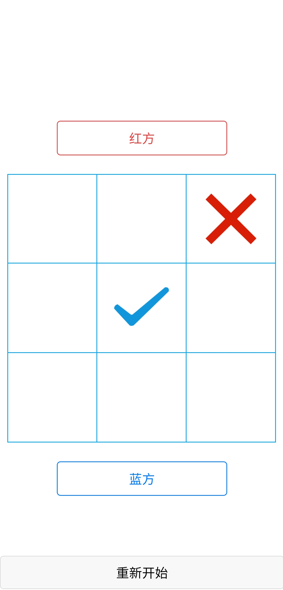

# 井字棋，英文名叫Tic-Tac-Toe
(就是猫和老鼠中汤姆和杰瑞玩的那个)

## 以下是来自百度百科的描述

井字棋，英文名叫Tic-Tac-Toe，是一种在3*3格子上进行的连珠游戏，和五子棋比较类似，由于棋盘一般不画边框，格线排成井字故得名。游戏需要的工具仅为纸和笔，然后由分别代表O和X的两个游戏者轮流在格子里留下标记（一般来说先手者为X）。由最先在任意一条直线上成功连接三个标记的一方获胜。比如像下图这样： 　　
玩过这个游戏的人大都会发现，如果两个玩家都作出最好的选择，这个游戏是一定会平局的。所以，井字棋最常使用是作为儿童游戏。 　　虽然这个游戏看上去很简单，但是它的整个过程却复杂得多。 　　从理论上讲，“井字棋”一共可能有19683种现象和362880种过程。（如果不把追求获胜的判定算进去的话） 　　当获胜导致游戏结束时，就只剩下255168种可能过程。假设其中X都是先手： 　　那么其中131184次将为X获胜，77904次将为O获胜，46080次为平局。 　　而当无视O和X的序列并消除所有对称的情况，就只剩下138种可能的结果了，其中91次是由X获胜，44次是由O获胜，只有3个独特的情况下才产生平局。 　　（在我看来，“井字棋”更像是一种由占据优势的X锻炼劣势下的O去寻找能够平局的3种方式的过程，这，在对儿童逻辑能力的培养上的确会有很好的作用。） 　　不过既然是游戏，这其中必然还是有策略的，如果你依照以下的优先顺序去玩这个游戏，你将有最完美的表现： 　　1.获胜：当你有两粒连子的时候，把他们连成3个。 　　2.阻挡：如果对方有两粒连子，阻止它们构成3连。 　　3.分枝：营造你可以通过两条路径获胜的机会。 　　4.阻止对方的形成分枝： 　　方法一：造成二连迫使对方阻挡，前提是对方的阻挡不能使对方获胜。 　　方法二：占据对方可以用来做成分枝的点。 　　5.中心：占据中心。 　　6.对角：如果对方在角上，占据与之相对的角。 　　7.空角：占据空余的角落。 　　8.空边：占据空余的边侧。 　　X玩家（先手）有三种可能的开局方式，一般来说，占据边、角、e68a8462616964757a686964616f31333264646563心中的任何一位X都有机会赢或至少逼平，然而选择角作为开局时留给O的选择是最少的（也就是说这时候O最容易走错）。 　　对于O玩家来说，他们必须选择中心以应对选择角的开局，选择角来应对选择中心的开局，当X开局选边时，O必须选择中心、与X相邻的角或者与X相对的边，不然就会输。 　　比如下图中，最后一行2、4、5、8、9、11、12的应对都是错误的。 　　
正确的开局应对一旦结束，根据以上的优先顺序走棋就会到达平局。所以一般来说，只有当X玩得不好时O才能够获胜。

## overview

基于国内知名的uni-app框架(使用vue.js开发android app ,微信小程序的前端应用的一套框架),官网<https://uniapp.dcloud.io/README>.
对于刚接触uni-app的新手，作为一个小的demo项目用来练手非常不错。

## 使用

* 你可以在apk文件夹中直接下载apk来体验(我只打包了android平台的apk包,如果你想运行在其他的平台,比如微信小程序或者ios端,需要自行打包,官网有详细打包教程).

* 下载官方提供的HBuilder软件,(嗯，官方还提供了云打包功能，所以本地几乎不需要再装什么其他的环境了)，将源码克隆下来然后使用HBuilder打开即可进行编译,调试等操作.

* 官网的文档十分详细，这里就不在啰嗦了.

Tips: 请不要直接将我的源码打包，你需要在官网注册一个账号并获得相应的app_id并填写到配置文件中.
